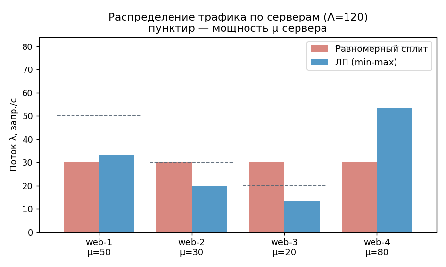
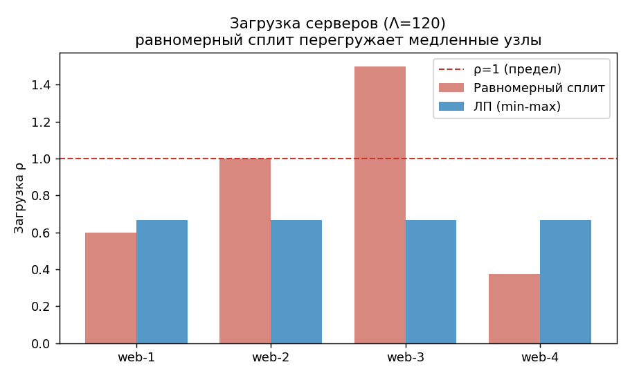
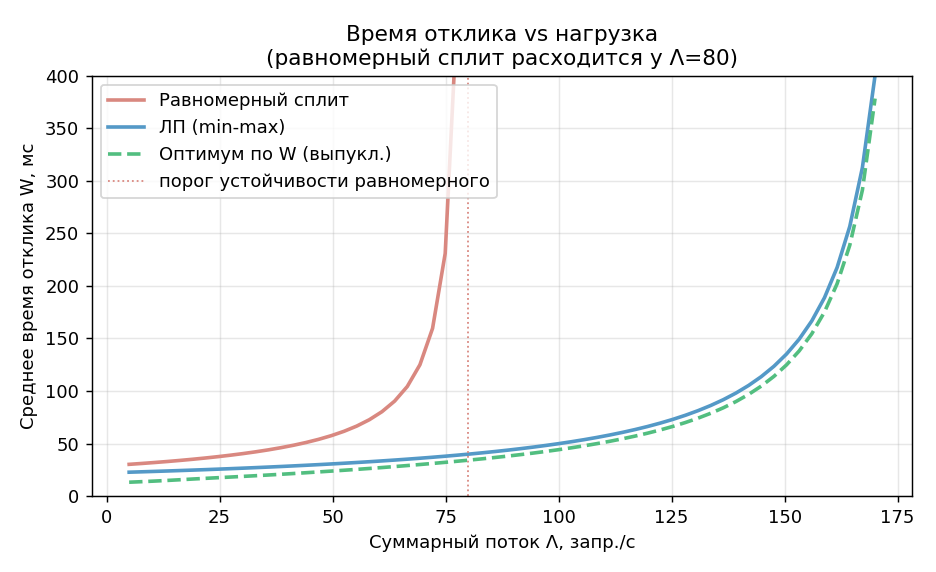

# ServerBalancer: Прототип балансировщика нагрузки

### Итоговый проект по курсу «Теория игр»

**Трек:** Программная инженерия · **Уровень:** 3 курс

| Поле               | Значение                                                              |
|--------------------|-----------------------------------------------------------------------|
| **Тема №7**        | ServerBalancer — прототип балансировщика нагрузки                     |
| **Комбинация тем** | СМО (системы массового обслуживания) + ЛП (линейное программирование) |
| **Автор**          | Соколов Глеб Константинович                                           |
| **Группа**         | ИТ-5                                                                  |
| **Руководитель**   | Шилина Алла Владимировна                                              |
| **Репозиторий**    | https://github.com/GoDL1ghT/game-theory/tree/main/lab4                |
| **Дата**           | 01.06.2026                                                            |

---

## Содержание

1. [Аннотация](https://github.com/GoDL1ghT/game-theory/blob/main/lab4/report.md#1-аннотация)
2. [Введение](https://github.com/GoDL1ghT/game-theory/blob/main/lab4/report.md#2-введение)
3. [Математическая модель](https://github.com/GoDL1ghT/game-theory/blob/main/lab4/report.md#3-математическая-модель)
4. [Архитектура и проектирование](https://github.com/GoDL1ghT/game-theory/blob/main/lab4/report.md#4-архитектура-и-проектирование)
5. [Реализация](https://github.com/GoDL1ghT/game-theory/blob/main/lab4/report.md#5-реализация)
6. [Тестирование](https://github.com/GoDL1ghT/game-theory/blob/main/lab4/report.md#6-тестирование)
7. [Эксперименты и результаты](https://github.com/GoDL1ghT/game-theory/blob/main/lab4/report.md#7-эксперименты-и-результаты)
8. [Выводы](https://github.com/GoDL1ghT/game-theory/blob/main/lab4/report.md#8-выводы)
9. [Список литературы и приложения](https://github.com/GoDL1ghT/game-theory/blob/main/lab4/report.md#9-список-литературы-и-приложения)

---

## 1. Аннотация

В работе разработан прототип балансировщика нагрузки **ServerBalancer**,
распределяющий входящий поток HTTP-запросов между гетерогенным пулом серверов.
Каждый сервер моделируется как одноканальная система массового обслуживания
**M/M/1** с собственной интенсивностью обслуживания, а задача распределения долей
трафика формализуется как **задача линейного программирования** с критерием
минимизации максимальной загрузки (min-max). Такая постановка строго линейна,
решается симплекс-методом (солвер CBC через библиотеку PuLP) и гарантированно
выравнивает утилизацию серверов, не допуская перегрузки бутылочного горлышка.

Решение сравнивается с двумя эталонами: наивным равномерным сплитом (round-robin)
и теоретическим оптимумом по среднему времени отклика (выпуклая задача, решаемая
SciPy). На трёх сценариях (штатном, пограничном и стрессовом) показано, что
линейная min-max-стратегия снижает среднее время отклика в разы и сохраняет
устойчивость пула там, где равномерное распределение приводит к расходимости
очередей. Корректность математического ядра подтверждена аналитически и
независимой имитацией на SimPy. Проект реализован с разделением слоёв (ядро / API /
конфигурация), снабжён REST-интерфейсом на FastAPI с health-check, контейнеризацией
(Docker) и набором тестов (pytest) с покрытием 95%.

*(≈190 слов)*

---

## 2. Введение

### 2.1. Формулировка задачи и предметная область

Балансировка нагрузки — базовая задача проектирования распределённых веб-систем.
Перед обратным прокси (nginx, HAProxy, облачный Load Balancer) стоит пул из N
серверов приложений, каждый из которых обрабатывает запросы с собственной
производительностью. Поступающий поток запросов нужно разделить между серверами
так, чтобы пользователи получали отклик как можно быстрее, а ни один сервер не
оказался перегружен (что приводит к лавинообразному росту очереди и отказам).

Простейшие промышленные алгоритмы (round-robin, случайный выбор) распределяют
запросы поровну и игнорируют разную мощность узлов. Если серверы гетерогенны
(а на практике это почти всегда так — разные поколения железа, разные
виртуальные машины), равномерное распределение перегружает слабые узлы при
недогрузке сильных. Цель проекта — построить **аналитический балансировщик**,
который, зная производительность каждого сервера и прогнозируемый поток,
рассчитывает оптимальные доли трафика.

Формально: задан пул серверов с интенсивностями обслуживания μ₁, …, μₙ (запросов в
секунду) и суммарный входящий поток Λ. Требуется найти интенсивности λ₁, …, λₙ,
направляемые на каждый сервер (Σ λᵢ = Λ), минимизирующие время отклика системы при
условии устойчивости всех очередей.

### 2.2. Обоснование выбора тем курса

Проект объединяет **две темы курса**, и обе содержательно необходимы.

**Системы массового обслуживания (СМО).** Сервер с очередью запросов — это
каноническая СМО. Поток запросов от множества независимых клиентов хорошо
описывается пуассоновским процессом (по теореме о суперпозиции независимых
потоков), а время обработки — экспоненциальным распределением (модель
максимальной неопределённости при заданном среднем). Это даёт модель **M/M/1**,
для которой существуют замкнутые формулы времени отклика и длины очереди. Без
аппарата СМО невозможно связать «долю трафика» с реальной метрикой качества —
временем отклика.

**Линейное программирование (ЛП).** Сам выбор долей трафика — это
оптимизационная задача с линейными ограничениями (баланс потока, пределы
загрузки). Критерий min-max (минимизация максимальной загрузки) сводится к
линейной задаче и решается за полиномиальное время. ЛП обеспечивает
**гарантию оптимальности** в отличие от эвристик и позволяет строго доказать,
что найденное распределение выравнивает нагрузку.

Связка работает так: **ЛП находит распределение потоков, а СМО оценивает его
качество** через время отклика. Темы дополняют друг друга, а не используются
формально.

### 2.3. Цели проекта и критерии приёмки

**Цель:** разработать воспроизводимый прототип, который по описанию пула серверов
и потока вычисляет оптимальное распределение трафика и демонстрирует его
преимущество над наивными стратегиями.

**Критерии приёмки:**

| № | Критерий | Способ проверки |
|---|---|---|
| 1 | Корректный расчёт метрик M/M/1 | Сверка с аналитическими значениями (unit-тесты) |
| 2 | Корректное решение ЛП (баланс потока, выравнивание загрузки) | Проверка инвариантов решателя (unit-тесты) |
| 3 | ЛП-стратегия не хуже эталонов по времени отклика | Эксперименты на 3 сценариях |
| 4 | Обнаружение перегрузки пула | Тест на неразрешимость ЛП |
| 5 | Воспроизводимый запуск (CLI / REST / Docker) | Интеграционные тесты, инструкция запуска |
| 6 | Покрытие тестами ≥ 60% | Отчёт pytest-cov |

---

## 3. Математическая модель

### 3.1. Вероятностный компонент: очередь M/M/1

Каждый сервер i рассматривается как одноканальная СМО **M/M/1**:

- запросы поступают пуассоновским потоком интенсивности λᵢ;
- время обслуживания распределено экспоненциально со средним 1/μᵢ;
- дисциплина обслуживания FIFO, буфер неограничен, один обслуживающий канал.

**Обоснование распределений.** Поток запросов на сервер формируется множеством
независимых клиентов; по предельной теореме о суперпозиции редких независимых
потоков суммарный поток сходится к пуассоновскому. Экспоненциальное время
обслуживания — модель с максимальной энтропией при фиксированном среднем
(свойство отсутствия памяти), дающая консервативную оценку изменчивости
(коэффициент вариации Cᵥ = 1).

Введём **коэффициент загрузки** ρᵢ = λᵢ / μᵢ. Для M/M/1 при ρᵢ < 1 справедливы
формулы стационарного режима:

```
ρᵢ      = λᵢ / μᵢ              коэффициент загрузки сервера i
P₀      = 1 − ρᵢ              вероятность простоя (0 заявок)
P_wait  = ρᵢ                  вероятность ожидания в очереди
L_q     = ρᵢ² / (1 − ρᵢ)      средняя длина очереди
W_q     = ρᵢ / (μᵢ − λᵢ)      среднее время ожидания в очереди
W       = 1 / (μᵢ − λᵢ)       среднее время отклика (ожидание + обслуживание)
```

Ключевое наблюдение: при ρᵢ → 1 время отклика W → ∞, то есть перегруженный сервер
недопустим.

### 3.2. Декомпозиция потока

Балансировщик расщепляет общий поток Λ на доли xᵢ ≥ 0, Σ xᵢ = 1, направляя на
сервер i поток λᵢ = xᵢ · Λ. По теореме о **разрежении (декомпозиции)
пуассоновского потока**: если каждый запрос независимо направляется на сервер i с
вероятностью xᵢ, то поток на сервер i остаётся пуассоновским с интенсивностью λᵢ.
Это обосновывает независимое рассмотрение каждого сервера как отдельной M/M/1.

### 3.3. Оптимизационный компонент: задача линейного программирования

**Переменные решения:** интенсивности λᵢ ≥ 0 для i = 1, …, N и вспомогательная
переменная z — верхняя граница загрузки пула.

**Постановка задачи** (минимизация максимальной загрузки, min-max):

```
минимизировать:   z

при условиях:
    λᵢ ≤ z · μᵢ          для всех i = 1..N     (загрузка ρᵢ ≤ z)
    Σ λᵢ = Λ                                   (баланс потока)
    λᵢ ≥ 0               для всех i
    0 ≤ z ≤ ρ_max                              (запас устойчивости)
```

Все ограничения и целевая функция линейны по (λ, z) — это **задача линейного
программирования** в чистом виде, решаемая симплекс-методом.

**Почему min-max снижает время отклика.** Время отклика Wᵢ = 1/(μᵢ − λᵢ) монотонно
растёт по загрузке ρᵢ и взрывается у самого загруженного («узкого») сервера.
Минимизируя максимальную загрузку, мы отодвигаем бутылочное горлышко от опасной
границы ρ = 1, что напрямую ограничивает наихудшее (и тем самым среднее) время
отклика.

### 3.4. Аналитическое решение и его свойства

**Утверждение.** Если Λ ≤ ρ_max · Σⱼ μⱼ, то оптимум задачи достигается при

```
z*  = Λ / (Σⱼ μⱼ)
λᵢ* = μᵢ · Λ / (Σⱼ μⱼ)
```

**Доказательство.** Просуммируем ограничения λᵢ ≤ z·μᵢ по всем i:
Σᵢ λᵢ ≤ z · Σᵢ μᵢ. С учётом баланса Σᵢ λᵢ = Λ получаем Λ ≤ z · Σᵢ μᵢ, откуда
z ≥ Λ / Σⱼ μⱼ. Эта нижняя граница достижима: при λᵢ = μᵢ · Λ / Σⱼ μⱼ выполнены и
баланс потока, и все ограничения с равенством ρᵢ = z*. ∎

**Следствия.**

1. Оптимальное распределение **пропорционально мощности** сервера:
   xᵢ* = μᵢ / Σⱼ μⱼ. Это совпадает с интуицией «нагружать сервер пропорционально
   его производительности», но здесь это строго доказанный оптимум, а не эвристика.
2. В оптимуме **все серверы загружены одинаково** (ρᵢ = z*), что и означает
   идеальную балансировку.
3. Среднее по системе время отклика при равной загрузке имеет замкнутый вид.
   Поскольку λᵢ/(μᵢ − λᵢ) = ρ/(1 − ρ) для каждого сервера:

```
W̄ = (1/Λ) · Σᵢ λᵢ/(μᵢ − λᵢ) = (1/Λ) · N·ρ/(1 − ρ) = N / ((1 − ρ*) · Σⱼ μⱼ)

где  ρ* = Λ / (Σⱼ μⱼ)   — общая загрузка пула
```

Для пула μ = (50, 30, 20, 80), Λ = 120: ρ* = 120/180 = 0,667, и
W̄ = 4 / (0,333 · 180) = 66,7 мс — значение, подтверждённое и кодом, и имитацией
(раздел 7).

### 3.5. Условия существования решения

**Существование оптимума ЛП.** Допустимое множество задаётся пересечением конечного
числа полупространств (линейные неравенства) и гиперплоскости (баланс потока) — это
**выпуклый многогранник** (полиэдр). Ограничения 0 ≤ λᵢ ≤ ρ_max·μᵢ и 0 ≤ z ≤ ρ_max
делают его **ограниченным**, следовательно **компактным**. Линейная (а значит
непрерывная) целевая функция на непустом компактном множестве достигает минимума
(теорема Вейерштрасса); по основной теореме линейного программирования оптимум
достигается в вершине многогранника.

**Условие непустоты (разрешимости).** Допустимое множество непусто тогда и только
тогда, когда поток не превышает суммарной мощности с учётом запаса:

```
Λ ≤ ρ_max · Σᵢ μᵢ
```

При нарушении этого условия пул физически не способен обслужить поток — задача
неразрешима (статус Infeasible), и система сигнализирует о перегрузке (см. раздел 6).

**Выпуклость эталонной задачи.** Для сравнения используется прямая минимизация
среднего времени отклика Σᵢ λᵢ/(μᵢ − λᵢ). Каждое слагаемое g(λᵢ) = λᵢ/(μᵢ − λᵢ)
выпукло и возрастает на интервале λᵢ ∈ [0, μᵢ): вторая производная
g″ = 2·μᵢ / (μᵢ − λᵢ)³ > 0. Сумма выпуклых функций выпукла, ограничения линейны —
это задача выпуклого программирования с единственным минимумом. Она нелинейна,
поэтому в основном балансировщике используется её линейный заменитель (min-max).

---

## 4. Архитектура и проектирование

### 4.1. Схема потоков данных

Система построена по принципу разделения слоёв: **конфигурация → ядро математики →
интерфейсы**. Ядро не знает ничего об интерфейсах; интерфейсы (CLI и REST) лишь
вызывают ядро.

```
                ┌──────────────────┐
                │  config/         │
                │  scenario.yaml   │
                └────────┬─────────┘
                         │ (raw dict)
                         ▼
                ┌──────────────────┐
                │  core/models.py  │  Pydantic-валидация
                │  Scenario        │  (μ>0, Σμ≥Λ, ...)
                └────────┬─────────┘
                         │ Scenario
         ┌───────────────┼────────────────┐
         ▼               ▼                ▼
┌────────────────┐ ┌──────────────┐ ┌──────────────────┐
│ core/balancer  │ │core/baselines│ │ core/queue_math  │
│ ЛП (PuLP)      │ │ эталоны+выпук│ │ метрики M/M/1    │
│  -> Allocation │ │  -> λ-вектор │ │  -> QueueMetrics │
└───────┬────────┘ └──────┬───────┘ └────────┬─────────┘
        │ λᵢ              │ λᵢ                │ Wᵢ, ρᵢ
        └─────────┬───────┴───────────────────┘
                  ▼
         ┌──────────────────┐        ┌──────────────────┐
         │ core/evaluate.py │<──────>│ core/simulation  │
         │  SystemReport    │        │  SimPy (валид.)  │
         └────────┬─────────┘        └──────────────────┘
                  │ SystemReport
        ┌─────────┴──────────┐
        ▼                    ▼
┌──────────────┐    ┌──────────────────┐
│  main.py     │    │  api/app.py      │
│  CLI (Rich)  │    │  FastAPI /balance│
└──────────────┘    └──────────────────┘
```

Это соответствует UML-диаграмме компонентов: компонент `core` экспортирует
интерфейсы расчёта, компоненты `cli` и `api` от него зависят (связь «использует»),
компонент `config` — поставщик данных.

### 4.2. Структура каталогов проекта

```
server_balancer/
├── config/
│   └── scenario.yaml          # пул серверов, поток Λ, SLA
├── core/                      # СЛОЙ МАТЕМАТИКИ (без I/O)
│   ├── queue_math.py          # метрики M/M/1 (и M/M/c как обобщение)
│   ├── balancer.py            # ЛП min-max на PuLP -> Allocation
│   ├── baselines.py           # equal_split / round_robin / convex_optimal
│   ├── evaluate.py            # агрегирование метрик -> SystemReport
│   ├── models.py              # Pydantic-схемы (ServerSpec, Scenario)
│   └── simulation.py          # имитация M/M/1 на SimPy
├── api/
│   └── app.py                 # FastAPI: GET /health, POST /balance
├── tests/                     # СЛОЙ ТЕСТОВ
│   ├── test_queue_math.py     # unit: формулы СМО
│   ├── test_balancer.py       # unit: корректность ЛП
│   └── test_integration.py    # integration: сценарий + API + SimPy
├── docs/
│   ├── figures/               # графики экспериментов (PNG)
│   ├── coverage/coverage.txt  # отчёт pytest-cov
│   └── results.csv            # сводная таблица экспериментов
├── experiments.py             # прогон сценариев + генерация графиков
├── main.py                    # CLI-точка входа (Rich)
├── Dockerfile                 # контейнеризация
├── docker-compose.yml         # health-check
├── requirements.txt
├── README.md
└── report.md                  # отчёт
```

### 4.3. Интерфейсы модулей

| Модуль / функция | Принимает | Отдаёт |
|---|---|---|
| `queue_math.calculate_mm1_metrics(λ, μ)` | поток и мощность сервера | `QueueMetrics` (ρ, P₀, P_wait, L_q, W_q, W, stable) |
| `balancer.solve_min_max(mus, Λ, ρ_max)` | список μ, суммарный поток, предел загрузки | `Allocation` (λ-вектор, доли, max_ρ, статус, feasible) |
| `baselines.equal_split(mus, Λ)` | список μ, поток | список λ (поровну) |
| `baselines.convex_optimal(mus, Λ, ρ_max)` | список μ, поток, предел | список λ (оптимум по W) |
| `evaluate.evaluate_allocation(names, mus, λ)` | имена, μ, распределение | `SystemReport` (метрики по серверам + среднее W, P_wait, max_ρ) |
| `simulation.simulate_mm1(λ, μ, n, seed)` | параметры очереди | среднее время отклика по имитации (с) |
| `api POST /balance` | JSON: серверы, Λ, ρ_max | JSON: распределение + метрики СМО |
| `api GET /health` | — | `{"status": "ok"}` |

Применённые паттерны: **Parameter Object** (`Scenario` агрегирует параметры
сценария), **Strategy** (взаимозаменяемые стратегии распределения: ЛП / равномерная
/ выпуклая имеют единый контракт — список μ и Λ на вход, λ-вектор на выход),
**Repository** (загрузка конфигурации изолирована в `load_scenario`).

---

## 5. Реализация

### 5.1. Стек библиотек и обоснование выбора

| Библиотека | Назначение | Обоснование |
|---|---|---|
| **PuLP** | моделирование и решение ЛП | Декларативный синтаксис задач ЛП, встроенный солвер CBC, не требует внешних зависимостей. Соответствует стеку темы №7. |
| **NumPy / SciPy** | численные операции, выпуклый оптимум | `scipy.optimize.minimize` (SLSQP) для эталонной нелинейной задачи. |
| **SimPy** | дискретно-событийная имитация | Независимая проверка аналитических формул M/M/1. Указана в стеке темы. |
| **FastAPI + uvicorn** | REST-сервис | Автогенерация OpenAPI/Swagger, валидация запросов через Pydantic, ASGI-производительность. Стек темы №7. |
| **Pydantic** | валидация входных данных | Декларативные схемы, отсечение некорректных μ, λ на границе. |
| **Rich** | CLI-вывод | Читаемые таблицы в терминале для демонстрации. |
| **PyYAML** | конфигурация | Человекочитаемый формат сценариев. |
| **pytest / pytest-cov** | тестирование | Стандарт де-факто, измерение покрытия. |

### 5.2. Ключевой алгоритм: ЛП min-max

Псевдокод:

```
ВХОД:  mus = [μ₁..μₙ], Λ, ρ_max
ВЫХОД: распределение λ = [λ₁..λₙ]

создать задачу минимизации
переменные: λᵢ ≥ 0 для всех i;  z ∈ [0, ρ_max]
целевая функция: minimize z
для каждого i:  добавить ограничение  λᵢ ≤ z · μᵢ
добавить ограничение:  Σ λᵢ = Λ
решить (симплекс-метод / CBC)
если статус ≠ Optimal: вернуть «перегрузка» (infeasible)
иначе: вернуть λ, доли xᵢ = λᵢ/Λ, max_ρ = max(λᵢ/μᵢ)
```

Фрагмент реализации (`core/balancer.py`):

```python
prob = pulp.LpProblem("min_max_load", pulp.LpMinimize)

lam = [pulp.LpVariable(f"lambda_{i}", lowBound=0) for i in range(n)]
z = pulp.LpVariable("z", lowBound=0, upBound=rho_max)

prob += z, "max_utilization"                       # целевая функция

for i in range(n):
    prob += lam[i] <= z * mus[i], f"load_cap_{i}"  # rho_i <= z
prob += pulp.lpSum(lam) == total_lambda, "conservation"

prob.solve(pulp.PULP_CBC_CMD(msg=False))
```

### 5.3. Ключевой алгоритм: метрики M/M/1

Фрагмент реализации (`core/queue_math.py`), включающий обработку неустойчивого
режима:

```python
rho = lambda_rate / mu_rate
stable = rho < 1.0
if not stable:                       # очередь растёт неограниченно
    return QueueMetrics(rho=rho, p0=0.0, p_wait=1.0,
                        l_q=inf, w_q=inf, w=inf, stable=False)

p0 = 1.0 - rho
p_wait = rho                         # P(ожидание) для M/M/1
l_q = rho**2 / (1.0 - rho)
w = 1.0 / (mu_rate - lambda_rate)    # среднее время отклика
```

### 5.4. Организация конфигурации и данных

Сценарий описывается в `config/scenario.yaml` и валидируется Pydantic-схемой
`Scenario` при загрузке. Валидация отсекает некорректные данные **до** запуска
расчёта: неположительные μ, отрицательный поток, неуникальные имена серверов, а
также перегрузку пула (Λ > ρ_max · Σμᵢ). Пример конфигурации:

```yaml
servers:
  - name: web-1       # быстрый узел
    mu: 50.0
  - name: web-2       # средний узел
    mu: 30.0
  - name: web-3       # медленный узел (узкое горлышко)
    mu: 20.0
  - name: web-4       # самый быстрый узел
    mu: 80.0

total_lambda: 120.0   # суммарный входящий поток, запр./с
rho_max: 0.95         # потолок загрузки сервера (запас устойчивости)

sla_w_ms: 200.0       # SLA: среднее время отклика ≤ 200 мс
sla_p_wait: 0.80      # SLA: вероятность ожидания ≤ 0.80
```

---

## 6. Тестирование

### 6.1. Типы тестов и фреймворк

Тестирование организовано на **pytest** и разделено на два уровня:

- **Unit-тесты** (`test_queue_math.py`, `test_balancer.py`) — проверяют отдельные
  функции ядра в изоляции: формулы СМО против аналитических значений и инварианты
  решения ЛП.
- **Integration-тесты** (`test_integration.py`) — проверяют связки: полный прогон
  сценария, REST-эндпоинты (через `fastapi.testclient`) и согласованность имитации
  SimPy с аналитикой.

### 6.2. Покрытие кода

Фактическое покрытие — **95%** (требование ≥ 60%), 35 тестов, время прогона ≈ 3 с:

```
Name                 Stmts   Miss  Cover
--------------------------------------------------
api/app.py              46      1    98%
core/balancer.py        42      1    98%
core/baselines.py       26      2    92%
core/evaluate.py        28      3    89%
core/models.py          31      1    97%
core/queue_math.py      47      3    94%
core/simulation.py      27      2    93%
--------------------------------------------------
TOTAL                  247     13    95%
35 passed in ~3s
```

### 6.3. Примеры тестовых сценариев и проверка корректности математики

**Проверка формул СМО (эталонный пример μ = 10, λ = 6).** Аналитически: ρ = 0,6;
W = 1/(10 − 6) = 0,25 с; W_q = 0,15 с; L_q = 0,9. Тест сверяет каждое значение:

```python
m = calculate_mm1_metrics(lambda_rate=6.0, mu_rate=10.0)
assert m.rho   == pytest.approx(0.6)
assert m.w     == pytest.approx(0.25)   # 1/(mu - lambda)
assert m.l_q   == pytest.approx(0.9)    # rho^2 / (1 - rho)
```

**Проверка инвариантов ЛП.** Для пула μ = (50, 30, 20, 80), Λ = 120 тест проверяет:
баланс потока (Σ λᵢ = Λ), сумму долей (Σ xᵢ = 1), **выравнивание загрузки** (все ρᵢ
равны Λ/Σμ = 0,667) и пропорциональность мощности:

```python
expected_rho = 120 / 180                # = 0.6667
rhos = [lam/mu for lam, mu in zip(alloc.lambdas, MUS)]
for r in rhos:
    assert r == pytest.approx(expected_rho, abs=1e-3)
```

**Проверка обнаружения перегрузки.** При Λ = 200 > 0,95 · 180 = 171 задача должна
быть неразрешима:

```python
alloc = solve_min_max(MUS, total_lambda=200.0, rho_max=0.95)
assert alloc.feasible is False
```

**Краевые случаи:** отрицательная λ, нулевая/отрицательная μ, ρ_max вне (0, 1] — все
вызывают `ValueError` (проверяется через `pytest.raises`). Нулевой поток даёт
корректное распределение без деления на ноль.

**Имитационная валидация (SimPy).** Среднее время отклика по имитации M/M/1
(μ = 10, λ = 6, 30 000 запросов) сверяется с аналитическим W = 0,25 с с
относительной погрешностью 20% — независимое подтверждение формул.

**Тестирование REST.** GET /health возвращает 200; POST /balance с валидным телом —
200 с выровненными ρ; перегруженный пул — 422; отрицательная μ — 422.

---

## 7. Эксперименты и результаты

### 7.1. Входные данные

Используется синтетический гетерогенный пул из 4 серверов с производительностями
μ = (50, 30, 20, 80) запр./с (суммарная мощность Σμ = 180). Сервер web-3 (μ = 20) —
самый слабый («узкое горлышко»), web-4 (μ = 80) — самый мощный. Рассматриваются три
сценария нагрузки:

| Сценарий | Λ, запр./с | Смысл |
|---|---|---|
| Штатный | 120 | типичная нагрузка (ρ* = 0,67) |
| Пограничный | 72 | низкая суммарная, но риск перегрузки слабого узла |
| Стрессовый | 160 | близко к пределу мощности (ρ* = 0,89) |

Сравниваются три стратегии: **равномерный сплит** (baseline, xᵢ = 1/N),
**ЛП min-max** (предлагаемая) и **выпуклый оптимум по W** (теоретический нижний
предел).

### 7.2. Результаты

**Сводная таблица** (среднее по системе время отклика W):

| Сценарий | Равномерный сплит | ЛП (min-max) | Оптимум по W |
|---|---|---|---|
| Штатный (Λ = 120) | **∞** (перегрузка) | 66,7 мс | 60,3 мс |
| Пограничный (Λ = 72) | 157,7 мс | **37,0 мс** | 31,1 мс |
| Стрессовый (Λ = 160) | **∞** (перегрузка) | 200,0 мс | 185,7 мс |

В штатном и стрессовом сценариях равномерный сплит перегружает слабые серверы
(ρ ≥ 1), и время отклика расходится; ЛП сохраняет устойчивость. В пограничном
сценарии равномерный сплит формально устойчив, но даёт в **4,3 раза** большее время
отклика (157,7 мс против 37,0 мс).

**Распределение трафика (штатный сценарий).** ЛП направляет поток пропорционально
мощности, тогда как равномерный сплит даёт всем поровну (рис. 1).



*Рис. 1. Распределение потока λ по серверам (Λ = 120). Пунктир — мощность μ
сервера. Равномерный сплит назначает web-3 (μ = 20) поток 30 > μ, что физически
невозможно обслужить.*

**Загрузка серверов (штатный сценарий).** ЛП выравнивает загрузку всех серверов до
ρ = 0,667; равномерный сплит выводит web-2 на ρ = 1,0 и web-3 на ρ = 1,5 — за предел
устойчивости (рис. 2).



*Рис. 2. Загрузка ρ по серверам (Λ = 120). Красная линия — предел ρ = 1. Столбцы
выше линии означают неустойчивую (расходящуюся) очередь.*

**Зависимость времени отклика от нагрузки.** При росте Λ равномерный сплит
расходится уже при Λ = 80 (когда λ на каждый сервер достигает μ слабейшего узла,
4 × 20). ЛП и выпуклый оптимум продолжают работать вплоть до суммарной мощности
≈ 171 (рис. 3).



*Рис. 3. Среднее время отклика в зависимости от суммарного потока Λ. Равномерный
сплит (красная) расходится у Λ = 80; ЛП (синяя) близка к выпуклому оптимуму
(зелёный пунктир) на всём диапазоне.*

### 7.3. Интерпретация

**Где модель работает лучше всего.** Преимущество ЛП тем заметнее, чем сильнее
**гетерогенность** пула: при разных μ равномерное распределение неизбежно
перегружает слабые узлы. ЛП устраняет это, выравнивая загрузку, и расширяет рабочий
диапазон системы почти до теоретического предела мощности.

**Где модель уступает оптимуму.** ЛП min-max минимизирует *максимальную загрузку*,
а не *среднее время отклика* напрямую. Поэтому выпуклый оптимум по W стабильно лучше
на 5–10% (например, 60,3 против 66,7 мс в штатном режиме): он сознательно
недогружает медленные серверы сильнее, жертвуя равномерностью ради среднего. Это
плата за линейность — но разница мала, а ЛП проще, быстрее и даёт строгие гарантии
устойчивости.

**Валидация.** Аналитический расчёт (W = N / ((1 − ρ*) · Σμ)), численная оценка через
ядро и имитация SimPy дают согласованные значения (66,7 мс в штатном сценарии), что
подтверждает корректность всей цепочки.

---

## 8. Выводы

### 8.1. Достижение целей и ограничения

Все критерии приёмки (раздел 2.3) выполнены: метрики M/M/1 верны (сверены
аналитически и имитацией), ЛП корректно решается и выравнивает загрузку,
предлагаемая стратегия превосходит равномерный сплит на всех сценариях (в разы по
времени отклика и по устойчивости), перегрузка пула обнаруживается, запуск
воспроизводим (CLI / REST / Docker), покрытие тестами 95%.

**Ограничения реализации:**

- **Стационарность.** Модель предполагает установившийся режим и постоянный поток Λ;
  всплески (burst) и нестационарность не учитываются.
- **Экспоненциальное обслуживание.** Реальное время обработки запросов часто менее
  изменчиво (Cᵥ < 1); модель M/D/1 или M/G/1 дала бы меньшее время ожидания.
- **Линейный заменитель цели.** min-max — это прокси, а не прямая минимизация W
  (отставание 5–10% от оптимума).
- **Независимость серверов.** Игнорируются общие ресурсы (БД, сеть) и отказы узлов.

### 8.2. Возможные улучшения

- **Алгоритмические:** добавить кусочно-линейную аппроксимацию 1/(μ − λ), чтобы
  напрямую минимизировать W, оставаясь в рамках ЛП; перейти к модели M/M/c для
  многоядерных серверов; учесть веса/приоритеты запросов.
- **Робастность:** формализовать неопределённость потока Λ как робастную
  оптимизацию или игру с природой (связь с темой матричных игр) — выбор
  распределения, устойчивого к худшему сценарию нагрузки.
- **Архитектурные:** динамический пересчёт распределения по телеметрии
  (онлайн-балансировка), кэширование решений ЛП, хранение истории в БД.
- **UX:** веб-дашборд (Streamlit) с интерактивными графиками, экспорт отчётов.

---

## 9. Список литературы и приложения

### 9.1. Источники

1. Клейнрок Л. *Теория массового обслуживания.* — М.: Машиностроение, 1979.
2. Таха Х. *Введение в исследование операций.* — М.: Вильямс, 2007. (Главы о ЛП и симплекс-методе.)
3. Harchol-Balter M. *Performance Modeling and Design of Computer Systems: Queueing Theory in Action.* — Cambridge University Press, 2013.
4. Boyd S., Vandenberghe L. *Convex Optimization.* — Cambridge University Press, 2004.

### 9.2. Документация библиотек

- PuLP: https://coin-or.github.io/pulp/
- SimPy: https://simpy.readthedocs.io/
- FastAPI: https://fastapi.tiangolo.com/
- Pydantic: https://docs.pydantic.dev/
- SciPy optimize: https://docs.scipy.org/doc/scipy/reference/optimize.html

### 9.3. Ссылка на репозиторий

https://github.com/GoDL1ghT/game-theory/tree/main/lab4

### 9.4. Инструкция по запуску

```bash
# Установка
python -m venv .venv && source .venv/bin/activate
pip install -r requirements.txt

# CLI-расчёт распределения
python main.py --config config/scenario.yaml

# Эксперименты (генерация графиков в docs/figures/)
python experiments.py

# Тесты с покрытием
pytest tests/ -v --cov=core --cov=api --cov-report=term-missing

# REST-сервис
uvicorn api.app:app --host 0.0.0.0 --port 8000
# проверка: curl http://localhost:8000/health

# Через Docker
docker compose up --build
```

### 9.5. Отчёт о покрытии и пример вывода

Отчёт pytest-cov сохранён в `docs/coverage/coverage.txt` (итог — 95%).

**Пример вывода CLI** (штатный сценарий):

```
ServerBalancer — распределение нагрузки

Серверов: 4 | Σμ = 180 запр./с | Λ = 120 запр./с | rho_max = 0.95

              ЛП (min-max загрузки)              
┏━━━━━━━━┳━━━━┳━━━━━━━┳━━━━━━━┳━━━━━━━┳━━━━━━━━━┓
┃ Сервер ┃  μ ┃     λ ┃     ρ ┃ W, мс ┃ Устойч. ┃
┡━━━━━━━━╇━━━━╇━━━━━━━╇━━━━━━━╇━━━━━━━╇━━━━━━━━━┩
│ web-1  │ 50 │ 33.33 │ 0.667 │  60.0 │    ✓    │
│ web-2  │ 30 │ 20.00 │ 0.667 │ 100.0 │    ✓    │
│ web-3  │ 20 │ 13.33 │ 0.667 │ 150.0 │    ✓    │
│ web-4  │ 80 │ 53.33 │ 0.667 │  37.5 │    ✓    │
└────────┴────┴───────┴───────┴───────┴─────────┘
           Baseline: равномерный сплит           
┏━━━━━━━━┳━━━━┳━━━━━━━┳━━━━━━━┳━━━━━━━┳━━━━━━━━━┓
┃ Сервер ┃  μ ┃     λ ┃     ρ ┃ W, мс ┃ Устойч. ┃
┡━━━━━━━━╇━━━━╇━━━━━━━╇━━━━━━━╇━━━━━━━╇━━━━━━━━━┩
│ web-1  │ 50 │ 30.00 │ 0.600 │  50.0 │    ✓    │
│ web-2  │ 30 │ 30.00 │ 1.000 │     ∞ │    ✗    │
│ web-3  │ 20 │ 30.00 │ 1.500 │     ∞ │    ✗    │
│ web-4  │ 80 │ 30.00 │ 0.375 │  20.0 │    ✓    │
└────────┴────┴───────┴───────┴───────┴─────────┘
            Сравнение стратегий (среднее по системе)             
┏━━━━━━━━━━━━━━━━━━━━━━━━┳━━━━━━━━━━━━━┳━━━━━━━━━━━━━━━━┳━━━━━━━┓
┃ Стратегия              ┃ Сред. W, мс ┃ Сред. P(ожид.) ┃ max ρ ┃
┡━━━━━━━━━━━━━━━━━━━━━━━━╇━━━━━━━━━━━━━╇━━━━━━━━━━━━━━━━╇━━━━━━━┩
│ Равномерный сплит      │           ∞ │          0.744 │ 1.500 │
│ ЛП (min-max)           │        66.7 │          0.667 │ 0.667 │
│ Оптимум по W (выпукл.) │        60.3 │          0.678 │ 0.742 │
└────────────────────────┴─────────────┴────────────────┴───────┘

SLA по времени отклика (≤ 200 мс): соблюдён (ЛП даёт 66.7 мс)
```

**Пример ответа REST** (GET /health):

```json
{
  "status": "ok",
  "service": "server-balancer"
}
```

**Пример ответа REST** (POST /balance):

```json
{
  "status": "Optimal",
  "feasible": true,
  "max_rho": 0.6666666666666666,
  "avg_w_ms": 66.66666515972229,
  "avg_p_wait": 0.6666666611111112,
  "all_stable": true,
  "servers": [
    {
      "name": "web-1",
      "mu": 50.0,
      "lambda_assigned": 33.333333,
      "fraction": 0.277777775,
      "rho": 0.6666666600000001,
      "w_ms": 59.999998800000036,
      "p_wait": 0.6666666600000001,
      "stable": true
    },
    {
      "name": "web-2",
      "mu": 30.0,
      "lambda_assigned": 20.0,
      "fraction": 0.16666666666666666,
      "rho": 0.6666666666666666,
      "w_ms": 100.0,
      "p_wait": 0.6666666666666666,
      "stable": true
    },
    {
      "name": "web-3",
      "mu": 20.0,
      "lambda_assigned": 13.333333,
      "fraction": 0.11111110833333333,
      "rho": 0.66666665,
      "w_ms": 149.99999250000036,
      "p_wait": 0.66666665,
      "stable": true
    },
    {
      "name": "web-4",
      "mu": 80.0,
      "lambda_assigned": 53.333333,
      "fraction": 0.4444444416666667,
      "rho": 0.6666666625000001,
      "w_ms": 37.49999953125001,
      "p_wait": 0.6666666625000001,
      "stable": true
    }
  ]
}
```
